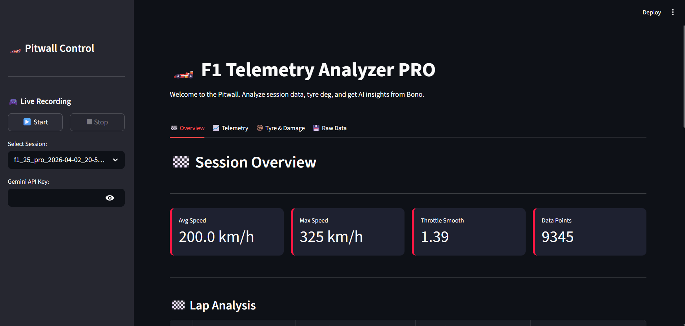
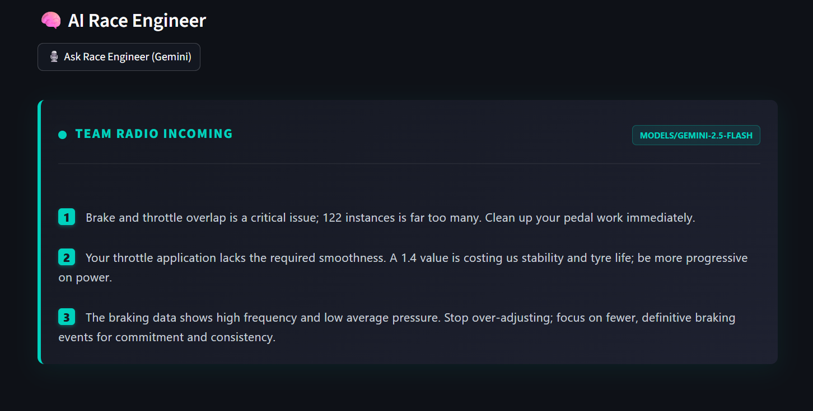
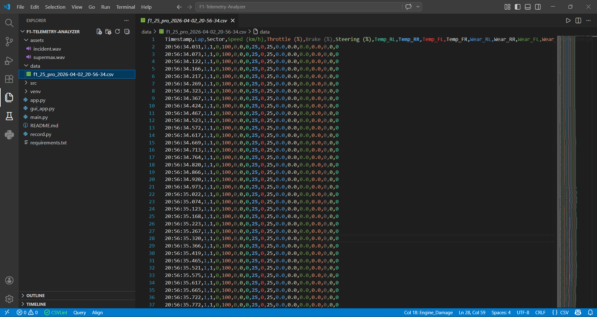

# 🏎️ F1 Telemetry Analyzer PRO

<p align="center">
  <b>Real-Time Telemetry • Performance Analysis • AI Race Engineer Insights</b><br>
  Built for Codemasters F1 Games (F1 22 → F1 25)
</p>

<p align="center">
  
  
  
  
  
</p>

---

## 🚀 Overview

A powerful, lightweight telemetry system that captures real-time UDP data from F1 games and transforms it into actionable performance insights. Featuring a built-in AI Race Engineer powered by Google's Gemini API to analyze your stints and give you brutal, professional pitwall feedback.

From raw data packets → clean CSV → visual dashboard → **AI driver improvement.**

> *"Find those last tenths."* 🏁

---

## 🎥 Demo 

https://youtu.be/lxzFz4OJxt4

---

## 📸 Screenshots

### 📊 Dashboard View


### 🎙️ AI Team Radio (Bono)


### 📁 CSV Output


> 

---

## ✨ Features

### 🧠 AI Race Engineer (Powered by Gemini)
* **"Bono" on the Pitwall:** Feeds your raw telemetry (speed, throttle smoothness, brake overlap) directly to Gemini AI.
* **Brutal & Actionable Feedback:** Get 3 precise, data-driven tips to improve lap time after every stint.
* **Premium UI:** Custom CSS "Team Radio Incoming" box with pulsing live-indicators and F1-style typography.

### 🎮 Smart Recording System
* Global Hotkey (**F9**) to start/stop recording.
* Works seamlessly while in-game (no Alt+Tab required).
* Audio feedback (race-style cues: incident/supermax).
* Automatic session-based CSV logging.

### 📊 Accurate Telemetry (F1 25 Fixed)
* Speed, Throttle, Brake, Steering traces.
* Tyre Temperatures & Realistic Grip Loss logic.
* Tyre Wear (real % values).
* Car Damage metrics (Front Wing, Rear Wing, Engine).
* Lap & Sector tracking (fixed offsets).

### 📈 Interactive Streamlit Dashboard
* Live-style interactive charts built with **Plotly**.
* Combined & separated pedal input views.
* Lap-by-lap speed comparisons.
* Tyre alert system (Overheating / Low Grip warnings).

---

## ⚙️ Tech Stack

* **Core:** Python 3.x
* **Data & Viz:** Pandas, Plotly Express
* **Frontend:** Streamlit (with Custom HTML/CSS/Regex)
* **AI:** Google Generative AI (`google-genai` / Gemini 2.5 Flash)
* **System:** UDP Socket Programming, PyQt5 (Launcher), Keyboard (Hotkeys)

---

## 🛠️ Installation

### 1️⃣ Clone Repo

```bash
git clone [https://github.com/godlike2004/F1-Telemetry-Analyzer-Pro.git](https://github.com/godlike2004/F1-Telemetry-Analyzer-Pro.git)
cd F1-Telemetry-Analyzer-Pro
```

### 2️⃣ Install Dependencies

Make sure to install the updated dependencies including the AI and graphing libraries:

```bash
pip install pandas streamlit PyQt5 keyboard plotly google-generativeai
```

---

## 🎮 Game Setup (IMPORTANT)

Go to your F1 Game: **Settings → Telemetry Settings**

| Setting                | Value       |
| ---------------------- | ----------- |
| UDP Telemetry          | ON          |
| UDP IP Address         | 127.0.0.1   |
| UDP Port               | 20778       |
| UDP Send Rate          | 20Hz / 60Hz |
| Broadcast Mode         | OFF         |
| Telemetry Restrictions | PUBLIC ✅    |

---

## 🏁 Usage

### 🔥 Easy Mode (Launcher)

```bash
python gui_app.py
```

### ⚙️ Manual Mode

1. Start the UDP listener:
```bash
python record.py
```
*(Press **F9** in-game to start/stop recording)*

2. Launch the Pitwall Dashboard:
```bash
streamlit run app.py
```

3. **Activate the AI:** Paste your Google Gemini API Key into the sidebar to unlock the AI Race Engineer.

---

## 📁 Project Structure

```text
F1-Telemetry-Analyzer/
│
├── record.py          # UDP Data Listener & Recorder
├── app.py               # Main Streamlit Dashboard & AI Logic
├── gui_app.py           # Desktop Launcher
├── data/                # Auto-generated CSV session logs
├── assets/              # README Images
├── incident.wav         # Audio Cue
├── supermax.wav         # Audio Cue
└── README.md
```

---

## 🧠 Latest Updates & Fixes

* **[NEW]** Integrated Gemini API for automated "Team Radio" performance debriefs.
* **[NEW]** Added Plotly interactive graphs for smooth telemetry zooming/panning.
* Fixed tyre wear always showing 0.0.
* Fixed lap & sector parsing.
* Corrected struct alignment for F1 25 UDP packets.

---

## 🚀 Roadmap

* Live telemetry streaming (no CSV saving delay)
* Automated Sector Delta analysis
* Racing line visualization (X/Y coordinate plotting)

---

## 🤝 Contributing

Pull requests are welcome! If you have ideas for improving the AI prompts, telemetry analysis, or UI visualization — go for it.

---

## ⭐ Support

If you like this project:
👉 Star the repo
👉 Share with racing friends
👉 Use it to get faster 😏

---

## 💬 Final Thought

This isn’t just telemetry.

It’s your **race engineer in code**. 🧠🏎️
---

## 👨‍💻 Developed By

**Harshit Singh Rathore**  
Telemetry Systems | Motorsport Analytics | AI Integration  

> *"Engineering performance, one lap at a time."*

🔗 GitHub: https://github.com/godlike2004
